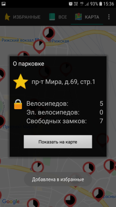

# Velocheck

Очень простой и лёгкий клиент для [московского велопроката Velobike](https://velobike.ru/). Вообще ничего лишнего.

* Не нужно логиниться
* Всего три экрана: карта, "избранные" и "все парковки".
* Избранные видны первыми! Открываете программу и сразу видите, где сколько велосипедов.

  

Забудьте бесконечное ожидание, пока грузится тяжёлый клиент, потом натыкивание пароля (не подходит), загрузку никому не нужной страницы аккаунта, переход из меню на карту, разыскивание приближением на ней парковок...

Нажали на иконку приложения - увидели свободные места.

Один сетевой запрос.
